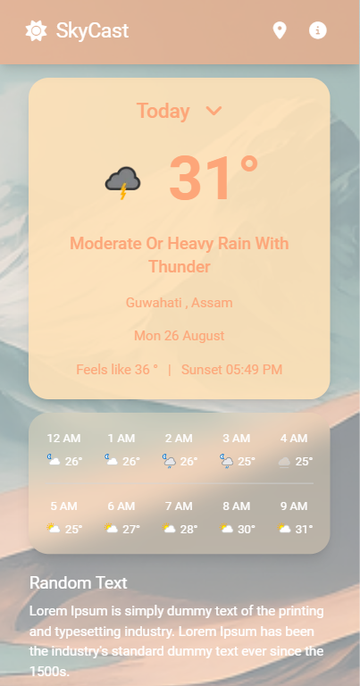
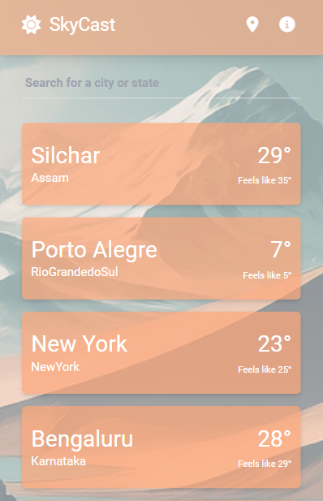
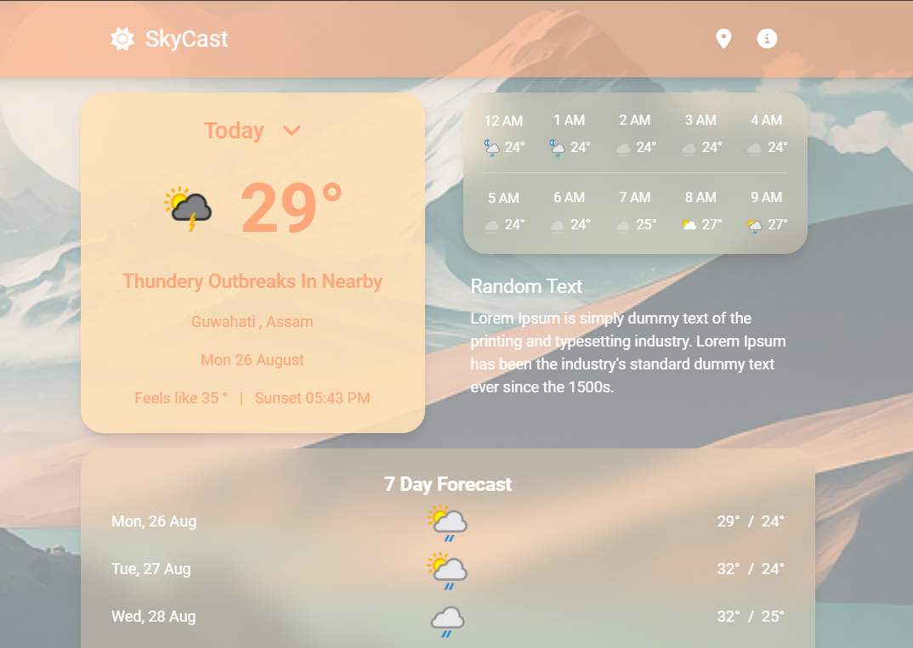

# Vue Weather App

A simple and responsive weather application built with Vue.js. This app allows users to input a city name and fetch current weather data using the MapBox and Weather API.

# Try it out : [SkyCast](https://nongpok-weather-app.netlify.app/)





## Features

- Search for weather information by city name.
- Displays temperature, weather description, and city name.
- Mobile-friendly and user-friendly interface.
- Allows user to save different cities.

## Technologies Used

- **Vue.js**: A progressive JavaScript framework for building user interfaces.
- **Weather API**: Provides weather data.
- **Mapbox API**: To search city name.
- **TailwindCSS**: For styling the application.

## Getting Started

### Prerequisites

Ensure you have the following installed on your local machine:

- [Node.js](https://nodejs.org/) (v12 or later)
- [npm](https://www.npmjs.com/) (Node package manager)

### Installation

1. **Clone the repository:**

   ```bash
   git clone https://github.com/Nonganba/weather-app.git
   cd weather-app

   ```

2. **Install dependencies and Run:**

   ```bash
   npm install
   npm run dev
   ```

## How to use

- On opening the homepage, the app will detect current location, and will preview the current weather.
- Click on the SkyCast logo on the top left and search for your city by entering the name into the search bar or click on the location icon to detect current location.
- Select a city within the results, this will take you to the current weather for your selection.
- Track the city by clicking on the "+" icon in the top right. This will save the city to view at a later time on the home page.
- If you no longer wish to track a city, simply select the city within the home page. At the bottom of the page, there will be an option to delete the city.
- Open the info icon on the top right of the app for more info.
  
